Glyph Dataset
=====
## Usage

```
> run.py
```

|Parameter|Description|Default|
|:---|:---|:---|
|dir_ttf|path of the directory including ttf files|ttfs|
|dir_save|path for the output directory|dataset_glyph|
|path_txt|path of the input text|text.txt|
|size_img|size for the output image|224|

## Center alignment
<div align="center">
  
  
  
  
  
  
  </br>
  
  
  
  
  
  
  </br>
  
  
  
  
  
  
  </br>
  
  
  
  
  </br>
</div>

<div align="center">
  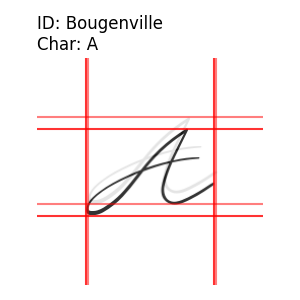
  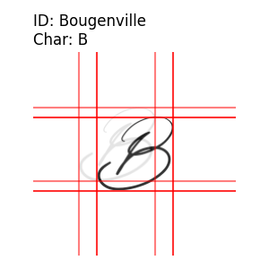
  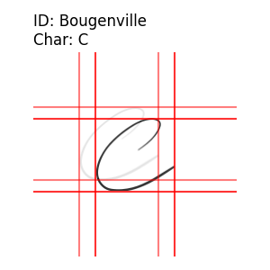
  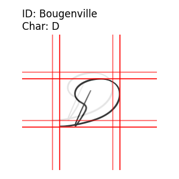
  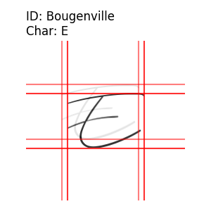
  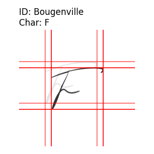
  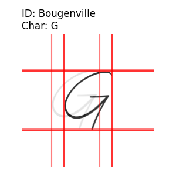</br>
  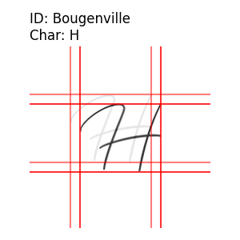
  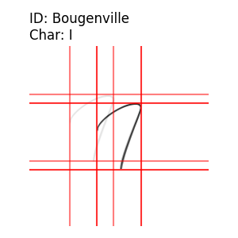
  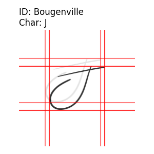
  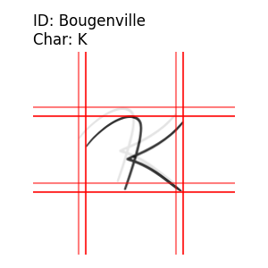
  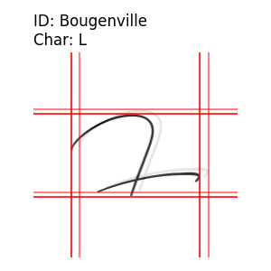
  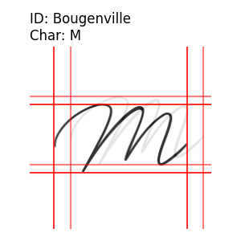
  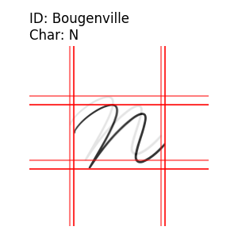</br>
  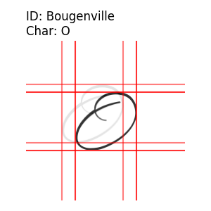
  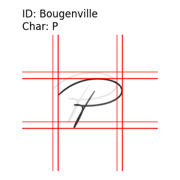
  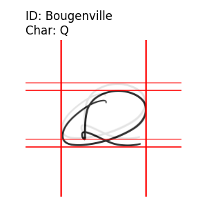
  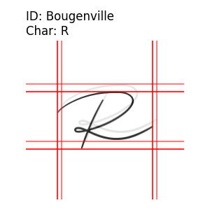
  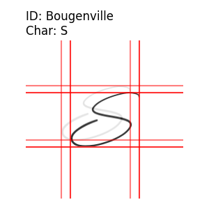
  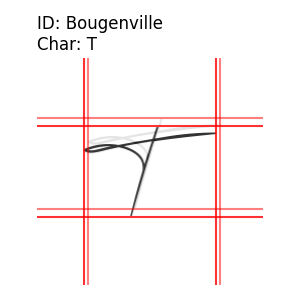
  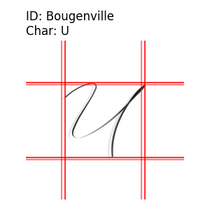</br>
  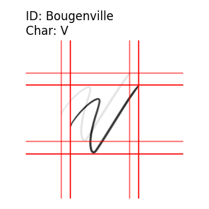
  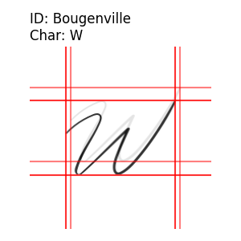
  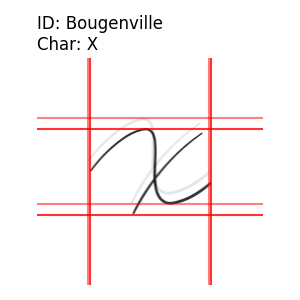
  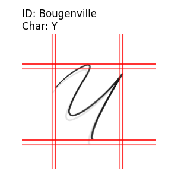
  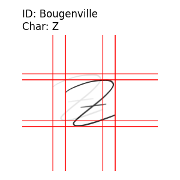</br>
</div>

## Reference
[1] 1001 Free Fonts: https://www.1001freefonts.com/  
